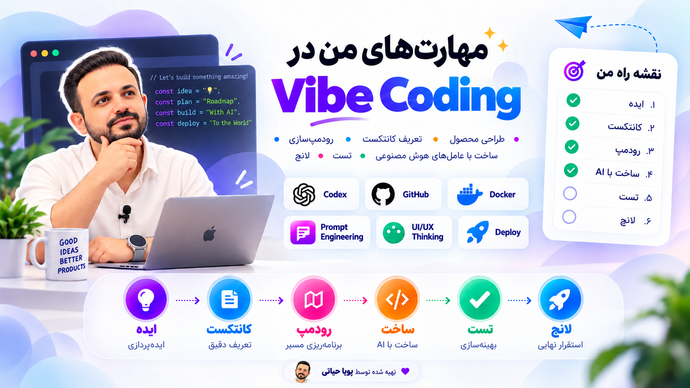

# Vibe Coding Skill

A risk-adaptive engineering Head for AI-assisted development of small, medium and large software projects, including WordPress plugins. Works with OpenAI Codex, Claude Code and compatible skill-based agents.

Current version: `1.5.0` — [stable release and portable ZIP](https://github.com/pooyahayati/Vibe-Coding-Skill/releases/tag/v1.5.0).

## One engineering Head, focused specialists

Vibe is the project manager and senior engineer: it owns scope, stack, architecture, risk, approvals, test selection, integration and final acceptance. Selected specialists supply domain methods and evidence under that authority; their rules are not duplicated in the Head.

## Development workflow

**Head:** Vibe owns the work. **Both:** the specialist supplies domain work and Vibe coordinates/accepts it. **Supporting:** scoped advice or evidence. Every stage remains Head-controlled.

| Stage | What happens | Who does it | When it applies |
|---|---|---|---|
| **1 · Discover** | Inspect rules, affected code, boundaries and risk; route capabilities. | **Head**; **Supporting:** debugging, necessary UI assessment, Graphify. | New objective or changed scope/impact evidence. |
| **2 · Define** | State the outcome, scope, protected behavior and acceptance criteria. | **Head**; **Supporting:** UI flows, security boundaries, API obligations. | Material requirements remain unclear; reuse settled decisions. |
| **3 · Plan** | Choose approach, installation target, ownership, sequence and checks; preflight Trivy for publication. | **Head**; relevant specialists **Supporting**. | New product/startup decisions; a written plan for high-risk or cross-boundary work. |
| **4 · Design** | Resolve changed UI, API and security decisions. | **Both:** selected specialists design their domains; Head owns architecture/integration. | Changed interfaces or trust boundaries need design. |
| **5 · Build** | Implement and integrate small runnable slices and selected packaging. | **Head**; **Both** on assigned domain surfaces; debugging **Supporting**. | Scope and necessary design decisions are ready. |
| **6 · Verify** | Check outcomes, relevant failures and selected installation behavior. | **Head** selects checks; **Both** for domain evidence; Trivy **Supporting**. | Relevant behavior changes; reuse sufficient existing evidence. |
| **7 · Review** | Assess the diff, findings, compatibility and evidence sufficiency. | **Head** owns readiness; domain review **Supporting**. | Before meaningful integration or merge. |
| **8 · Ship** | Deliver the authorized artifact/release/deployment and verify its state; require native Trivy scans before publication. | **Head**; retained evidence and delivery debugging **Supporting**. | Delivery is authorized and required gates pass. |

These are responsibilities, not eight mandatory documents or approvals. Small tasks combine stages; larger work iterates vertical slices. Failed checks return to the affected decision. [Canonical lifecycle and exit conditions](references/operating-model.md#canonical-lifecycle-and-ownership).

## Project size and risk tiers

Project complexity, task risk and affected scope are separate decisions. A payment change in a small plugin can be critical; a label correction in a large app can stay lightweight.

| Project size | Typical shape | Delivery route |
|---|---|---|
| **Small** | Focused site, utility or plugin with few components. | Simplest adequate stack, short runnable steps, focused checks. |
| **Medium** | Multiple features, modules or integrations. | Clear boundaries, vertical slices, affected contract/integration checks. |
| **Large** | Multiple domains, teams, services or data/operational boundaries. | Decompose, confirm ownership/contracts, map consequential impact and integrate verifiable slices. |

| Task tier | Typical change | Required depth |
|---|---|---|
| **0 · Tiny** | Local, reversible copy/visual change without security/data effects. | Understand, change and focused check; usually no new automated test. |
| **1 · Standard** | Bounded feature. | Acceptance, impact, implementation, relevant tests and review. |
| **2 · Significant** | Auth, migrations, integrations, shared contracts or meaningful dependencies. | Explicit spec/plan, impact analysis and stronger relevant security/regression checks. |
| **3 · Critical** | Destructive/irreversible work, sensitive data or material production impact. | Tier 2 controls, required approval, recovery plan and strong evidence; stop if critical verification is missing. |

WordPress work additionally preserves public APIs, authorization, lifecycle/data retention, affected WooCommerce compatibility and the exact installable ZIP. [Operating model](references/operating-model.md) · [Risk rules](references/risk-and-autonomy.md).

## Registered specialists

| Specialist | Purpose and trigger | Main stages |
|---|---|---|
| [UI-UX-Skill](https://github.com/pooyahayati/UI-UX-Skill) | **Sole design specialist:** supported product UI, responsive/RTL, accessibility and rendered validation. | Design · Build · Verify · Review |
| [Security and hardening](https://github.com/addyosmani/agent-skills/tree/main/skills/security-and-hardening) | Auth/access, sensitive data, uploads, payments and external trust boundaries. | Design · Build · Verify · Review |
| [API and interface design](https://github.com/addyosmani/agent-skills/tree/main/skills/api-and-interface-design) | Producer/consumer contracts, errors, compatibility, retries and idempotency. | Design · Build · Verify · Review |
| [Debugging and error recovery](https://github.com/addyosmani/agent-skills/tree/main/skills/debugging-and-error-recovery) | Unclear/intermittent failures, repeated failed fixes and delivery failures. | Discover · Build · Verify · Ship on failure |

Select matching domains only; never install the entire external collection. Current installation, instruction compatibility, scoped return and Head acceptance are separate checks. [Composition and freshness](references/specialist-composition.md).

| Role | Responsibility | Boundary |
|---|---|---|
| **Vibe Head** | Engineering decisions, integration, acceptance and authorized delivery. | System/developer/user instructions, project rules and host permissions remain authoritative. |
| **Specialist** | Assigned domain decisions, authorized edits, relevant checks and findings. | Cannot independently expand scope, change architecture, install arbitrary dependencies, start agents or publish. |
| **Tool** | Requested graph/scan evidence. | Grants no permissions or final engineering authority. |

Head precedence cannot dismiss a real vulnerability or contradictory evidence. These are instruction boundaries, not an OS sandbox. [Authority contract](references/specialist-authority.md).

## Graphify and Trivy: supporting tools

| Tool | Purpose | When used | Limits |
|---|---|---|---|
| [Graphify](https://github.com/Graphify-Labs/graphify) | Code relationships and consequential impact analysis. | Discover/Plan and targeted Review for unfamiliar or cross-module work. | Confirm relationships in source/runtime; use source analysis if unavailable. Semantic processing needs its own authorization. |
| [Trivy](https://github.com/aquasecurity/trivy) | Local secret and relevant dependency/configuration scans. | Plan: native availability. Verify/Review: findings. Ship: final-artifact scans required before publication. | Missing/failed/incomplete scans block publication; a clean scan does not prove application logic or authorization. |

Keep generated reports outside product source. Development uses native project controls; Trivy is the only additional scanner in the Head workflow. [Native release gate](references/security-and-dependencies.md#native-release-gate).

## Verification and delivery

- Define an observable user/system outcome and preserve approved scope, business rules and platform invariants. Select checks from changed behavior and meaningful failures, without fixed test counts, coverage quotas or unrelated reruns. Required project checks still apply.
- Structured tasks retain criteria and validate local receipts against scoped inputs/artifacts. Legacy reports remain declared evidence; tiny/manual work needs no forced automated test. The Head still assesses whether a check proves the outcome. [Completion and trust limits](references/execution-and-verification.md#receipt-backed-completion-e2).
- Deliver what works, how to start/use it, actual checks, unresolved limits and the next action. Merge, release, deployment and local installation are distinct outcomes.

The Head chooses the simplest reproducible product startup path. Suitable self-hosted apps can offer local Docker Compose execution, verified from clean startup through a core workflow and required data persistence. Containers do not replace WordPress ZIPs or native desktop/mobile packages, establish offline operation, or prove production readiness. [Product installation policy](references/product-installation-and-runtime.md).

## Requirements, updates and feedback

Python 3.10+ and Git are required; network access supports current upstream/dependency evidence. Graphify is conditional. Missing Trivy can warn during Skill installation but blocks software publication until the native gate passes.

Resolve the Head and selected specialists to the latest stable release, using the default branch only when no stable release exists. Preserve local edits, record provenance and keep instructions stable during an assignment. Reconcile installed specialists daily during active preflights; idle checks need a host scheduler. Install/update only within existing authorization. This does not upgrade the product stack.

For a suspected defect in Vibe itself, prepare a minimal English local report with attribution and evidence. After removing sensitive details, the user may email it to **hayatipooya@gmail.com**; nothing is sent automatically. [Feedback route](references/skill-feedback.md).

## Documentation

- [Install and verify](HOW_TO_INSTALL.md) · [Version updates](UPDATES.md) · [Technical changelog](CHANGELOG.md)
- [Current status and roadmap](ROADMAP.md) · [Implementation and acceptance index](docs/improvement-implementation-plan.md)
- [Skill instructions](SKILL.md) · [Lifecycle and architecture](references/operating-model.md) · [Context and planning](references/context-routing-and-execution.md)
- [Specialist composition](references/specialist-composition.md) · [Authority](references/specialist-authority.md) · [Shared formats and migration](references/shared-improvement-contracts.md)
- [Verification](references/execution-and-verification.md) · [WordPress delivery](references/wordpress-delivery.md) · [Security reporting](SECURITY.md)
- [Contributor checks](CONTRIBUTING.md) · [Maintainer validation and evidence limits](references/validation-and-benchmarking.md)

## License

[MIT](LICENSE)

## Author

Created and maintained by **PooyaHayati | پویا حیاتی**.

Website: [https://Pooyahayati.com](https://Pooyahayati.com)
